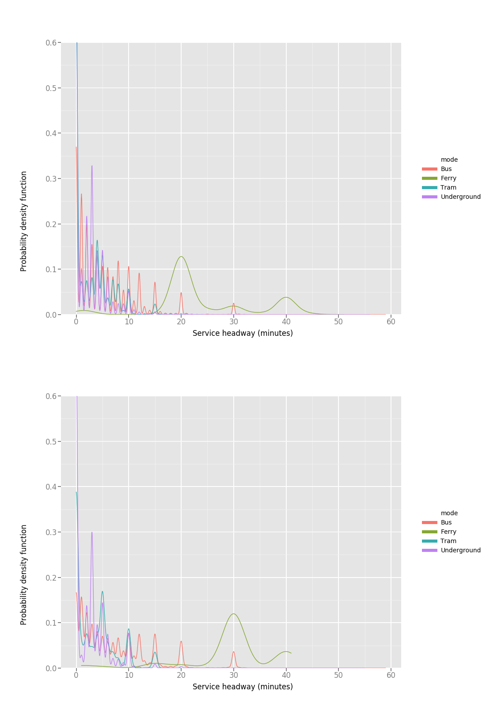

### GTFS to a frequency based graph conversion

### Input

This Python script takes a [GTFS](https://developers.google.com/transit/gtfs/) file in a `.tar.gz` format (to reduce size). These may be generated from the [tfl_gtfs repository](https://github.com/cb-cities/tfl_gtfs).

### Executing the script

Change to the `src` directory:

`cd src`

Execture the Python script and pass the location of your input file. In this case, it is found within a `tmp` directory.

`python analysis.py -i ../tmp/tfl_gtfs_2017-02-07_05.tar.gz`

Example output:

```
python analysis.py -i ../tmp/tfl_gtfs_2017-02-07_05.tar.gz
Converting GTFS data into usable format
Creating stop_times db
15204494  stop times loaded
Creating trips db
Creating stops db
Creating calendar db
Creating routes db
# There are often errors within GTFS datasets - a check is performed.
There are 0 missing records from the original 725
Dumping to file (../out/data_errors/missing_routes.json.gz)
Creating edges for services
15204494  stop_times loaded
```

### Outputs

The output is a series of JSON files explaining unique edges. 

edge example:

```
{
    "index":0,
    "polyline":[
      541479.9724723536,
      174563.1806094267,
      541689.0233260792,
      174629.198668519
    ],
    "modes":[
      "Bus"
    ],
    "edge_id":"490015018N490015477E",
    "negativeNode":"490015018N",
    "services":[
      {
        "route_id":"b15",
        "route_type":"Bus",
        "journey_time":60,
        "arrival_time":1446441660,
        "route_agency":"tfl",
        "departure_time":1446441600
      },
      {
        "route_id":"b15",
        "route_type":"Bus",
        "journey_time":60,
        "arrival_time":1446443460,
        "route_agency":"tfl",
        "departure_time":1446443400
      },
      {
        "route_id":"b15",
        "route_type":"Bus",
        "journey_time":60,
        "arrival_time":1446445260,
        "route_agency":"tfl",
        "departure_time":1446445200
      } ...
      "graph":"GTFS",
      "journey_time":60.0,
      "positiveNode":"490015477E"
  },
      
```
vertex example:
```
{
    "toid":"910GALRESFD",
    "index":0,
    "point":[
      51.854001,
      0.997437
    ]
  } ...
```

address example:

```
{
    "toid":"910GALRESFD",
    "text":"Alresford (Essex) Rail Station",
    "index":0
  } ...

```


#### Station PageRank output example

#### Service headway output example

Weekday services (top) and weekend services (bottom)

